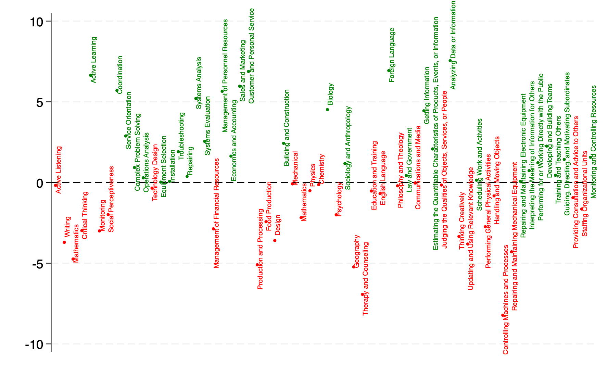
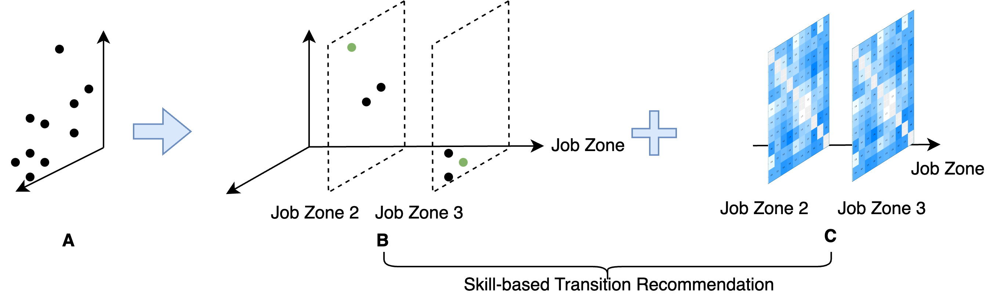

<!-- Text can be **bold**, _italic_, or ~~strikethrough~~. -->

# Green skill-based recommendation system

In every job we do, we bring a core set of necessary skills and often, through on-the-job training, we acquire additional skills to help us execute our work satisfactorily. A close similarity between jobs implies that if the green transition impacts an individual, they can effectively leverage existing skills along with purposeful reskilling to transition between jobs. Using the green skill-based recommendation system we developed, we provide the job options and reskilling requirements for all jobs in the economy. 

The system consists of a **[multidimensional green skill space](./green-skill-space/green-skill-space.md)** and a **[unidimensional skill dissimilarity heatmap](./green-skill-dissimilarity/green-skill-dissimilarity.md)**, both offering insights into occupational transitions within the green economy. This system identifies transition options for jobs within the same level of career preparation by visually displaying similar jobs that utilize their existing skills in the green skill space. It presents a sorted order of transition options of green/neutral/brown occupations in the green skill dissimilarity heatmap. By decomposing the dissimilarity through a comparison of green skills, the system clearly outlines the re-skilling requirements necessary for successful job transitions. The recommendation system equips job seekers, career switchers, and policymakers with information about potential green career options and the re-skilling requirements based on their current skill endowments. 


# Green Skills
What are green skills? Identify green skill through LASSO regression.



# Workflow of Building the Green Skill-based System
- Build on the skill space by green skills.
- Construst the green skill dissimilarity to show how close jobs are in terms of green skills.



<!-- 
----------
# [Interactive Green Skill Space.](./green-skill-space/green-skill-space.md)
- For all jobs in the economy, their green category, and their location in green skill space.
- Green skill space by the level of education, experiences, and training (job zone).

----------

# [Interactive Green Skill Dissimilarity between any pair of occupations.](./green-skill-dissimilarity/green-skill-dissimilarity.md)
- Interactive heatmaps show green skill dissimilarity by job zone along with detailed green skill differences.  
 - A quick preview here! [The green skill dissimilarity heatmap for all jobs. ](./assets/heatmaps/Heatmap_interactive_heatmap_blue.html)
----------

# [Data](./green-skill-data.md)
- Occupational **Green Potentia Index**.
- Green occuptions.
- Brown occuptions.
- Skills and job zones.

----------
# Others
- [Skill Space using full set of skills](./assets/skillspace/AllSkillSpace_cluster_plot.html)
- Crosswalk.

-->


----------

<table class="gallery-grid">
  <tr>
    <td width="50%" valign="top">
      <h3><a href="./green-skill-space/green-skill-space.md">Interactive Green Skill Space</a></h3>
      <ul>
        <li>For all jobs in the economy, their green category, and their location in green skill space.</li>
        <li>Green skill space by the level of education, experiences, and training (job zone).</li>
      </ul>
    </td>
    <td width="50%" valign="top">
      <h3><a href="./green-skill-dissimilarity/green-skill-dissimilarity.md">Interactive Green Skill Dissimilarity</a></h3>
      <ul>
        <li>Interactive heatmaps show green skill dissimilarity by job zone along with detailed green skill differences.</li>
      </ul>
    </td>
  </tr>
  <tr>
    <td width="50%" valign="top">
      <h3><a href="./green-skill-data.md">Data</a></h3>
      <ul>
        <li>Occupational <strong>Green Potential Index</strong>.</li>
        <li>Green occupations.</li>
        <li>Brown occupations.</li>
        <li>Skills and job zones.</li>
      </ul>
    </td>
    <td width="50%" valign="top">
      <h3>Others</h3>
      <ul>
        <li><a href="./assets/skillspace/AllSkillSpace_cluster_plot.html">Skill Space using full set of skills</a></li>
        <li>Crosswalk.</li>
       <li>The working paper is available upon request.</li>
      </ul>
    </td>
  </tr>
</table>


----------
[Back](../index.md)

<!-- 


[Green Plotly](./GreenSkillSpace_cluster_plot_highlight.html). **This is how you show the HTML interactive directly.**
[Green Plotly webpage](./plotly.md). **This is how you show the HTML interactive directly.**


[Plotly2 Random plot](./my_interactive_plot.html). **This is how you show the HTML interactive directly.**
[Plotly2 Random plot](./plotly2.md). **This is how you actually embed the interactive map in a webpage.**

There should be whitespace between paragraphs.

There should be whitespace between paragraphs. We recommend including a README, or a file with information about your project.

# Header 1

This is a normal paragraph following a header. GitHub is a code hosting platform for version control and collaboration. It lets you and others work together on projects from anywhere.

## Header 2

> This is a blockquote following a header.
>
> When something is important enough, you do it even if the odds are not in your favor.

### Header 3

```js
// Javascript code with syntax highlighting.
var fun = function lang(l) {
  dateformat.i18n = require('./lang/' + l)
  return true;
}
```

```ruby
# Ruby code with syntax highlighting
GitHubPages::Dependencies.gems.each do |gem, version|
  s.add_dependency(gem, "= #{version}")
end
```

#### Header 4

*   This is an unordered list following a header.
*   This is an unordered list following a header.
*   This is an unordered list following a header.

##### Header 5

1.  This is an ordered list following a header.
2.  This is an ordered list following a header.
3.  This is an ordered list following a header.

###### Header 6

| head1        | head two          | three |
|:-------------|:------------------|:------|
| ok           | good swedish fish | nice  |
| out of stock | good and plenty   | nice  |
| ok           | good `oreos`      | hmm   |
| ok           | good `zoute` drop | yumm  |

### There's a horizontal rule below this.

* * *

### Here is an unordered list:

*   Item foo
*   Item bar
*   Item baz
*   Item zip

### And an ordered list:

1.  Item one
1.  Item two
1.  Item three
1.  Item four

### And a nested list:

- level 1 item
  - level 2 item
  - level 2 item
    - level 3 item
    - level 3 item
- level 1 item
  - level 2 item
  - level 2 item
  - level 2 item
- level 1 item
  - level 2 item
  - level 2 item
- level 1 item

### Small image


### Large image


### Definition lists can be used with HTML syntax.

<dl>
<dt>Name</dt>
<dd>Godzilla</dd>
<dt>Born</dt>
<dd>1952</dd>
<dt>Birthplace</dt>
<dd>Japan</dd>
<dt>Color</dt>
<dd>Green</dd>
</dl>

```
Long, single-line code blocks should not wrap. They should horizontally scroll if they are too long. This line should be long enough to demonstrate this.
```

```
The final element.
``` -->
